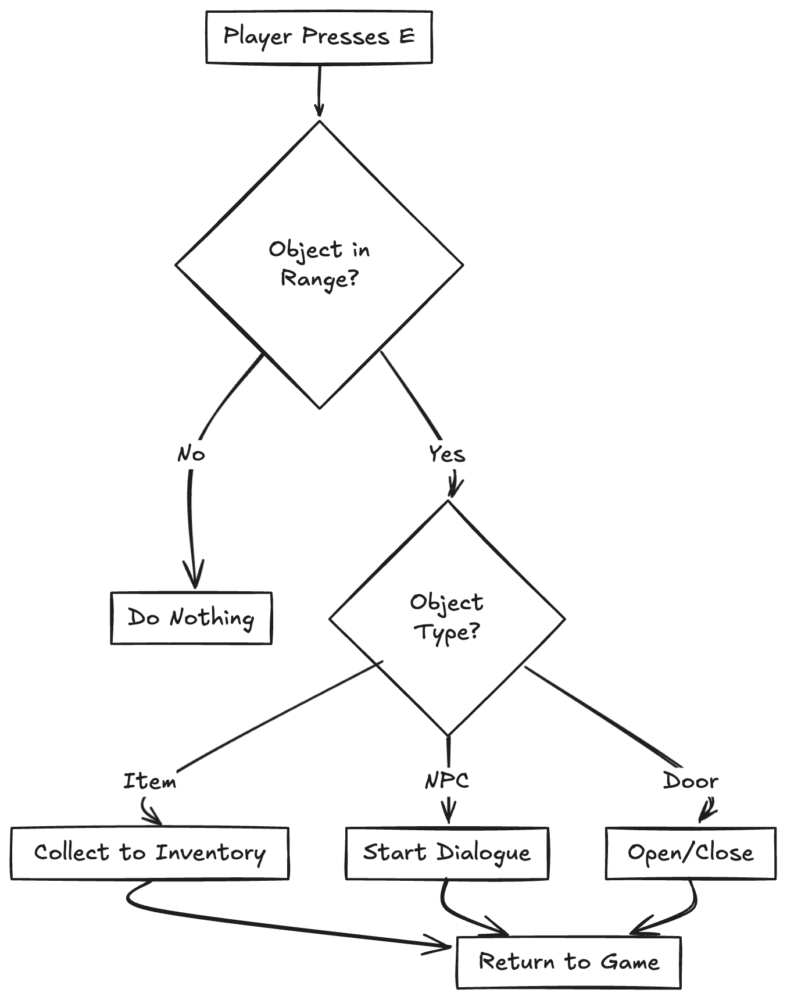
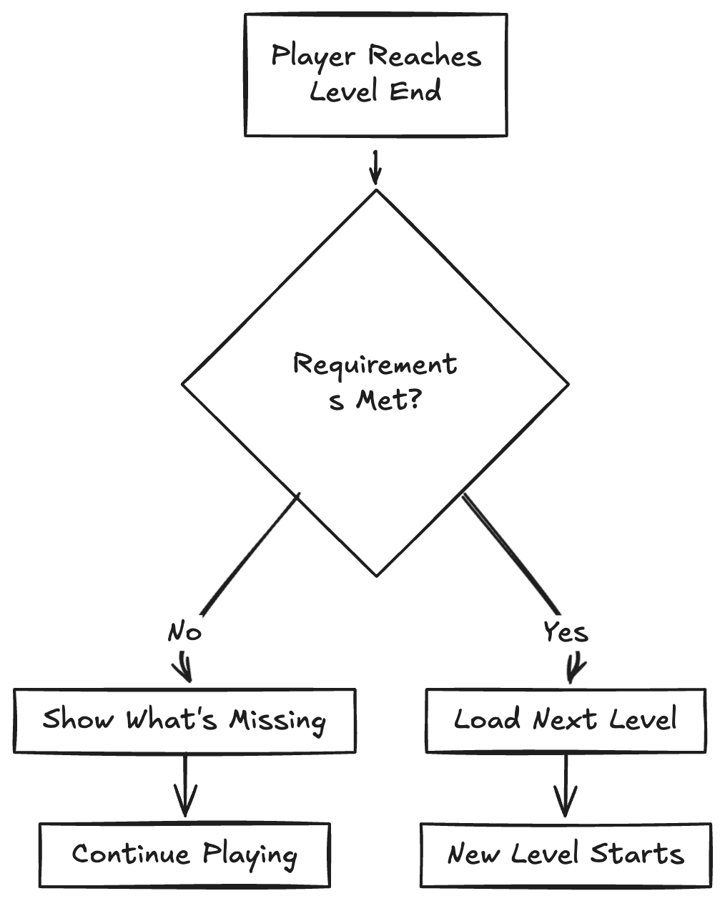
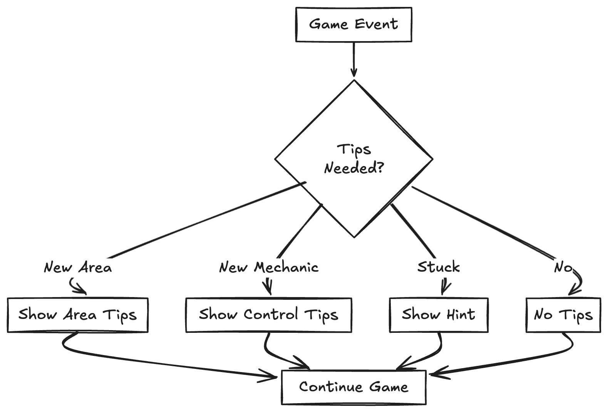

# *Project Documentation*
## <span style="color: #4CC6ED;">Identifying and Defining</span>
### Idea
My Idea for this game is for it to be a puzzle room inspired by ***Portal*** and ***Escape Simulator*** with there being a variety of rooms and different mechanics and puzzles to figure out


### Identifying a Need
My game will address the growing urge for entertainment and the crave for fulfillment as they pass through this game
### Requirements Outline
#### Inputs
- Keyboard Control(W,A,S,D or Arrow Keys)
- Mouse Controls(Optional)
- Interact Button(Optional)
#### Processing
- Detect Player Movement, Collisions with wallks and objects
- Can verify if a "puzzle" or a "room" is finished
- Opening Doors when a condition is met
- Tracking Progress
#### Outputs
- Changes in the Scene(Door Opening)
- Tips
- Changing to next level after hitting the goal
#### Transmission
- None Needed
#### Storage
- Sprites/Charactar
- Player Progress
### <span style="color: #4ced84ff;">Functional Requirements</span>
- Simple Player Controls
- Interactions with Objects
- Able to Continue on to other levels
- Tips
### <span style="color: #ed4c4cff;">Non-Functional Requirements</span>
- Hard but not too hard of puzzles
- Smooth Gameplay
- Stable(No crashing)
- Rating on how good you did
### Social And Ethical Issues
#### Definitions:
- Equity: Giving people what they need to succeed
- Accessibility: Making sure everyone is able to play the game
#### Accessibility
My game needs to be able to be playable by everyone using methods such as subtitles and a built in help system
#### Privacy and Data Protection
My game will save the progress on your computer whilst also not taking any personal information
#### Mental And Emotional Well-Being
My game is meant to not be frustrating and for it to be a fun challenge instead to prevent this i will add a built in help system
#### Cultural Sensitivites
This game has a variety of different levels and areas with none of them being offensive to anyone i will make sure there will not be any insensitive symbols that may disrespect cultures
## <span style="color: #4CC6ED;">Researching and Planning</span>
### Evaluation of Existing Ideas
| Existing Idea | Plus | Minus | Implication |
| :--- | :--- | :--- | :--- |
| | Portal is great at making and introducing unique mechanics and building complex puzzles from simple objects/Mechanics | The Game is quite Short and has a small amount of levels Leaving players longing for more|For my game i will Include the unique mechanics from portal and i will avoid creating puzzles that make people frustrated |
| | Escape simulator does an amazing job in offering a large variety of escape rooms and Enjoyable puzzles| The game can feel Clunky and less smooth compared to other games, this games puzzles can also be very frustrating and not make sense|my game will include the vast amount of puzzle rooms and different puzzles as well as polishing my game so its not clunky |
| | Escape Academy does a great job at combing the escape room genre with a location | The Game is primarily designed for co-op which can make the single player gamemode more difficult|i will design my game to be more Simple and less frustrating not requiring much critical thinking skills but still making it hard|
### Pseudo Code and Flow Chart
#### Movement
- Pseudo Code
```
FUNCTION HandleMovement()
IF KeyPressed(A) THEN
    MovePlayer(LEFT)
END IF

IF KeyPressed(D) THEN
    MovePlayer(RIGHT)
END IF

IF KeyPressed(W) THEN
    MovePlayer(FORWARD)
END IF

IF KeyPressed(S) THEN
    MovePlayer(BACKWARD)
END IF
END FUNCTION
```

- Flow Chart 


#### Interactions
- Pseudo Code
```
FUNCTION HandleInteractions()
IF KeyPressed(E) THEN
    IF ObjectInRange() THEN
        SWITCH ObjectType OF
            CASE ITEM:
                AddToInventory(Object)
                ShowMessage("Item Collected")
            CASE NPC:
                StartDialogue(Object)
            CASE DOOR:
                ToggleDoor(Object)
        END SWITCH
    END IF
END IF
END FUNCTION
```

- Flow Chart

#### Continue
- Pseudo Code
```
FUNCTION CheckLevelProgress()
    IF PlayerAtLevelEnd THEN
        IF LevelRequirementsMet THEN
            LoadNextLevel()
            ShowLevelTips()
        ELSE
            ShowRequirementsMessage()
        END IF
    END IF
END FUNCTION
```
- Flow Chart

#### Tips/Help
- Pseudo Code
```
FUNCTION ShowTips()
    IF PlayerInNewArea THEN
        DisplayAreaTips()
    END IF
    
    IF NewMechanicIntroduced THEN
        DisplayControlTips()
    END IF
    
    IF PlayerStuckForLongTime THEN
        DisplayHint()
    END IF
END FUNCTION
```

